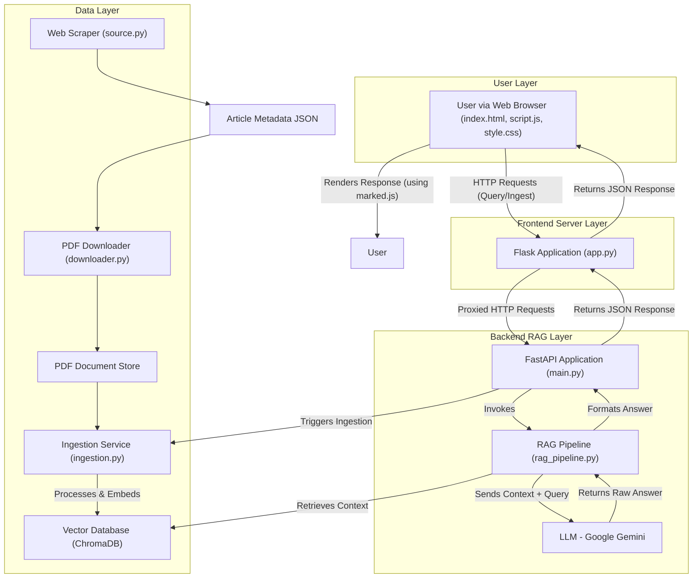

# 🧠 Mat-Trix: Assistant for Materials Science Research

Mat-Trix is an AI-powered assistant that answers natural language questions about the **latest materials science papers** published on [Nature.com](https://www.nature.com/). It uses **Retrieval-Augmented Generation (RAG)** to provide accurate, citation-backed answers directly from full-text PDFs—no model training required.

---

## 🚀 Features

- 🔄 **Daily Auto-Update**: Automatically scrapes and updates the latest research.
- 📄 **PDF Ingestion**: Full papers are downloaded and stored in a vector database.
- 🤖 **LLM-based Q&A**: Gemini + LangChain generates accurate, contextual answers.
- 🔗 **Citations Included**: Each response is backed by real document sources.
- 🌐 **Simple Frontend**: Lightweight HTML/CSS/JS UI served via Flask.

---

## 🧰 Tech Stack

| Component     | Tool/Library               |
|---------------|----------------------------|
| Backend       | FastAPI, LangChain         |
| Middleware    | Flask                      |
| Vector Store  | ChromaDB                   |
| LLM           | Gemini (or compatible)     |
| Scraping      | Playwright, BeautifulSoup  |
| PDF Downloads |  aria2c                    |
| Frontend      | HTML, CSS, JavaScript      |
| Automation    | Bash scripts (`start.sh`, `update.sh`) |

---

## ⚙️ How It Works

1. `source.py` scrapes new article links from Nature’s Materials Science section.
2. `downloader.py` fetches the PDF files for these articles.
3. `update.sh` ingests new PDFs into the vector database.
4. Users interact via a web UI powered by Flask → FastAPI.
5. The backend returns answers with proper citations using RAG.



---

## 🛠️ Setup & Usage

### 1. Clone the repo
```bash
git clone https://github.com/nandan645/mat-trix.git
cd mat-trix
````

### 2. Install dependencies

```bash
pip install -r requirements.txt
```

### 3. Scrape article metadata (required once or for daily updates)

```bash
python source.py
```

### 4. Downloads article from ```mature_articles.json``` created by ```source.py```

```bash
python downloader.py
```

### 5. Start the full application

```bash
./start.sh
```

This runs both the **FastAPI backend** and **Flask frontend**.

### 6. Ingest new papers into the vector DB

Keep the server running, and in a new terminal run:

```bash
./update.sh
```

---

## 📅 Automation Tips

* Add a cron job to run `source.py` and `update.sh` daily for auto-updates.

---

## 🙌 Acknowledgments

* [Nature.com](https://www.nature.com/) for article metadata
* LangChain, ChromaDB, Gemini
* Playwright, FastAPI, Flask, BeautifulSoup

---

## 💡 Future Enhancements

* Add filtering (date/topic/access type)
* Expand to multiple journals or subjects
* User-uploaded PDF support
* Answer export/download options

---

## ❓ Need Help?

Open an [issue](https://github.com/nandan645/mat-trix/issues) or contact the maintainer.
